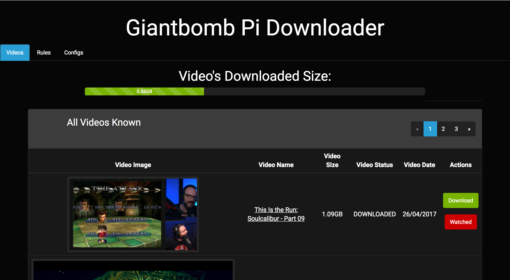

## Giantbomb Downloader

If your reading this then our situations could be similar, you love GiantBomb and your internet is just not that great... I developed this tool to download my favourite Giantbomb videos ready for my morning commute, while my power hungry PC and I sleep.

I present Giantbomb Downloader:


## How does it work?
TLDR: It's a PHP Site which uses the Giantbomb API to fetch latest videos. I've created an automated script which will install everything on a raspberry pi (it's how I use it and kinda designed it for).    


I built the tool using the [Laravel Framework](https://laravel.com/) and [Giantbomb's API](https://www.giantbomb.com/api/).

## How to Install?
``` shell
curl -sSL https://raw.githubusercontent.com/Adam2Marsh/giantbomb_downloader/master/automated_install/gb_downloader_install.sh | bash
```


## Contributing
If your using the tool and think its missing a key feature then raise an issue with as much detail as possible. Thanks!

### License
The Giantbomb Downloader is open-sourced software licensed under the [MIT license](http://opensource.org/licenses/MIT)